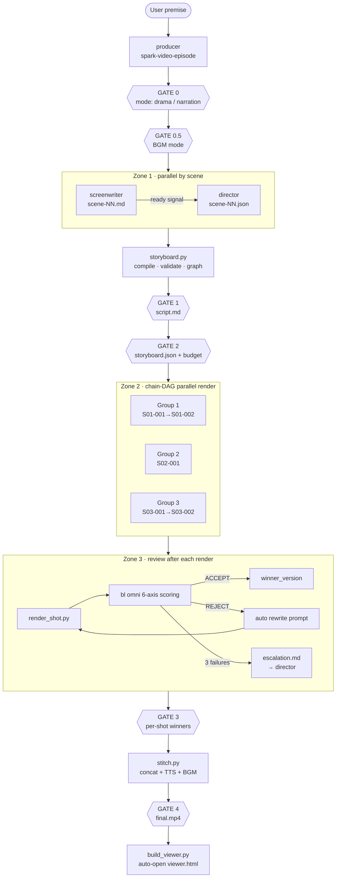
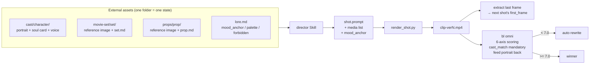
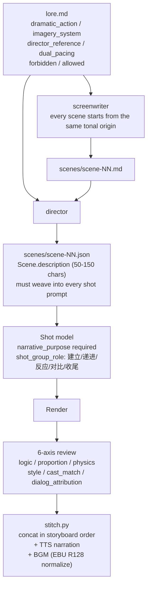
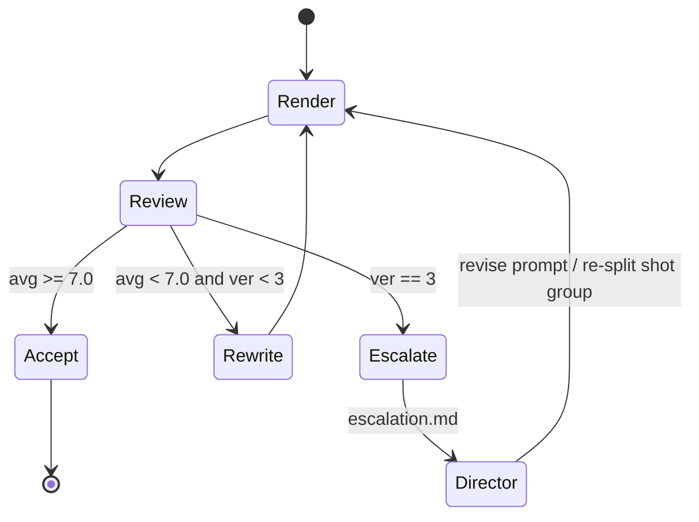
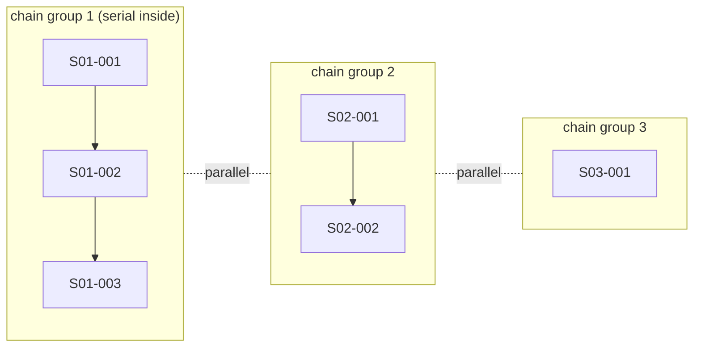

Spark-Video breaks "making an AI short episode" into 6 independent Skills and a set of deterministic scripts, wired into a **script → storyboard → render → review → stitch** pipeline. It tackles two hard problems every long-form video AIGC project must face:

1. **Cross-shot consistency** — faces, sets, props, and art style must not drift from clip to clip.
2. **Narrative unity** — 20+ independently generated 8s clips must assemble into a logically coherent, thematically focused story.

Project entry points: [SKILL.md](https://github.com/JohnKeating1997/spark-video/blob/main/SKILL.md) · [`lib/`](https://github.com/JohnKeating1997/spark-video/tree/main/lib) · [`scripts/`](https://github.com/JohnKeating1997/spark-video/tree/main/scripts) · [`references/`](https://github.com/JohnKeating1997/spark-video/tree/main/references)

## 3.1 It Is First a "Skill", Not a Standalone CLI

Spark-Video's entire product shape is a stack of `SKILL.md` files plus deterministic scripts:

```
videoGen/
├── SKILL.md                                ← router / root Skill
├── references/
│   ├── spark-video-episode/SKILL.md        ← producer (one-shot production)
│   ├── spark-video-screenwriter/SKILL.md   ← screenwriter
│   ├── spark-video-director/SKILL.md       ← director / storyboarder
│   ├── spark-video-cast/SKILL.md           ← art (cast/set/prop)
│   ├── spark-video-vfx-review/SKILL.md     ← pre-render static quality gate
│   └── spark-video-clip-review/SKILL.md    ← post-render QC + re-render state machine
├── scripts/   ← pure functional scripts: render_shot.py · storyboard.py · stitch.py …
└── lib/       ← data models (Pydantic) + engineering infrastructure
```

This shape delivers three direct benefits:

### 3.1.1 Framework-Agnostic — Loadable by Any Mainstream Agent Framework

`SKILL.md` is plain Markdown plus a YAML front-matter block, with no runtime binding. Any Agent that follows a "read prompt → call tools" protocol can plug in:

- **Claude Code** / **Claude Agent SDK** — native Skill support.
- **AgentScope** — treat each `SKILL.md` as a system prompt segment; register scripts as tools.
- **LangGraph / AutoGen / custom Agents** — same pattern: Skills are prompts, scripts are shell tools.
- **Cursor / Continue and other IDE assistants** — feed `references/*/SKILL.md` directly into context.

Because there is no runtime binding, **upgrading the Agent framework does not require changing this project; swapping the base model does not either**.

### 3.1.2 The Agent Has Autonomy — Not a Fixed Script Pipeline

`SKILL.md` describes **judgment criteria and contracts**, not a rigid step sequence. For example, [spark-video-clip-review/SKILL.md](https://github.com/JohnKeating1997/spark-video/blob/main/references/spark-video-clip-review/SKILL.md) says:

```
while ver <= max_retry:
    render → review → if ACCEPT done · elif retry: rewrite prompt · else escalate
```

How each rewrite **changes the prompt**, what feedback to give the director on escalate, and which shot in a group is the real problem — all of that is decided at runtime by the Agent from the specific critique returned by `bl omni`. It will:

- Read critique text in `reviews/<shot>-verN.json` and identify failure types (face drift / dialog mismatch / physics).
- Call `bl text chat` to rewrite the prompt (not template substitution — targeted rewrites based on the failure reason).
- After 3 rewrites still fail, write `reviews/escalation-<id>.md` for the director Skill — that escalation doc is not a template; it is a diagnostic report the Agent writes after summarizing the current failure pattern.
- When multiple shots fail at once, decide autonomously whether to **re-render one by one** or **go back to the director to re-split the shot group**.

This "push judgment to the Agent" design lets the pipeline handle infinitely many model failure modes, instead of only the ones engineers pre-enumerated.

### 3.1.3 Fully Conversational Edits — Keep Chatting After the Final Cut

The full pipeline has 4+2 user confirmation gates (see §3.2 below). At each gate:

- The user can say in natural language *"S03 pacing is too slow — cut the dialogue in half"* — the Agent locates `scenes/scene-03.md` and invokes the screenwriter Skill to rewrite.
- The user can say *"郭芙蓉 wears a wedding dress this episode"* — the Agent forks `cast/郭芙蓉/` at the episode layer, regenerates portraits, and triggers re-renders for affected shots.
- After GATE 4 delivers `final.mp4`, the user can still say *"S05-002 expression is wrong — swap in another version"* — the Agent re-renders only that shot, then incrementally stitches.

None of this requires rerunning the whole flow — the Agent reads `shots_state.json` and existing artifacts to know **what has already been done and what can be done incrementally**.

## 3.2 Pipeline Overview: 6 Roles + 4 Quality Gates



The four "user confirmation gates" sit at the four irreversible cost checkpoints: **script, storyboard, render results, final cut**. Design philosophy: **expose the uncontrollable parts of LLM/video models to humans as early as possible**, so you do not discover at GATE 3 that the story went off the rails at GATE 1.

| Gate | What it blocks on |
|---|---|
| GATE 0 | mode (drama short-form / narration voiceover) |
| GATE 0.5 | BGM mode (off / global / scene) |
| GATE 1 | `script.md` — story must pass before storyboarding |
| GATE 2 | `storyboard.json` + budget — storyboard/cost must pass before render |
| GATE 3 | per-shot winners — every clip must pass before stitch |
| GATE 4 | `final.mp4` — final cut review |

`shots_state.json` is the pipeline's **single source of truth** — only [`scripts/render_shot.py`](https://github.com/JohnKeating1997/spark-video/blob/main/scripts/render_shot.py) writes it, serialized with `flock`; every other script reads. That constraint prevents the race where two parallel render processes append attempts and overwrite each other.

## 3.3 How Consistency Across Video Clips Is Enforced

Video foundation models are **memoryless** — each shot is an independent request. Spark-Video uses four redundant layers — **reference images + anchor phrases + last-frame continuation + post-render review** — to fight model drift.



### 3.3.1 Three Pillars: Cast / Movie-Set / Prop — "One Folder = One Visual State"

This is the project's hardest rule, written into [references/spark-video-cast/SKILL.md](https://github.com/JohnKeating1997/spark-video/blob/main/references/spark-video-cast/SKILL.md):

| Pillar | What it locks | Folder pattern | State splitting |
|---|---|---|---|
| **Cast** (character) | face / hair / costume / physique | `cast/<name>/` | full-episode costume change → derive `陆辰-汉服` |
| **Movie-Set** (set) | location / lighting / dressing | `movie-set/<name>/` | day / night → `客栈-白天` / `客栈-夜晚` |
| **Prop** (key prop) | signature object | `props/<name>/` | intact / wrinkled / torn → three separate folders |

The iron rule: **"video models treat reference images like text; mixing two states in one folder only produces one blurred average"**.

Each folder is one **soul card** (`cast.md` / `set.md` / `prop.md`, parsed by [`lib/soul.py`](https://github.com/JohnKeating1997/spark-video/blob/main/lib/soul.py)) + N reference images + optional voice sample:

```
cast/郭芙蓉/
├── 郭芙蓉.md      ← soul card: age / catchphrases / visual anchors / do-don't
├── 郭芙蓉.png     ← portrait
└── 郭芙蓉.mp3     ← reference_voice for r2v
```

> Real example: [cast/郭芙蓉.md](https://github.com/JohnKeating1997/spark-video/blob/main/cast/%E9%83%AD%E8%8A%99%E8%93%89.md) — it pins `voice_style`, `catchphrases`, `mannerisms`, and other traits that recur in dialogue. Those fields are for the **LLM** (screenwriting / storyboarding), not the video model.

### 3.3.2 Portraits Lock Appearance; Prompts Describe Action Only

One of the iron rules at the top of [SKILL.md](https://github.com/JohnKeating1997/spark-video/blob/main/SKILL.md):

> Character costume / hair / makeup **do not go in the prompt** — the portrait locks them; the prompt describes action + expression only, with age on first appearance (e.g. "28-year-old 陆辰")

If the prompt says "white dress shirt" but the portrait shows a black hoodie, the video model **interpolates freely** between them — shot 1 gray tee, shot 2 white shirt, shot 3 black hoodie. **Making the portrait the sole authority on appearance** cuts off that drift path.

### 3.3.3 Multiple Portraits of One Character → Auto Grid; Never Mix Across Characters

[`lib/cast.py`](https://github.com/JohnKeating1997/spark-video/blob/main/lib/cast.py) `_build_grid`: when a character folder has ≥2 portraits, they are composited into one grid PNG for r2v (Wan and HappyHorse both support multi-panel references).

```python
# lib/cast.py:207-235
def _build_grid(images: list[Path], out: Path, *, max_side: int = 1280) -> Path:
    """Compose N (>=2) portraits *of the same character* into a grid PNG."""
    if len(images) < 2:
        raise ValueError("_build_grid expects 2+ images of the same character.")
```

**Grids are always built inside one character folder, never mixed across characters** — so the model does not blend two characters' features.

### 3.3.4 Two-Layer Cast System: Project-Wide Shared + Episode Override

```
projects/<p>/cast/<name>/          ← project leads (shared across episodes)
projects/<p>/<ep>/cast/<name>/     ← episode-only NPCs or costume overrides
```

[`lib/cast.py`](https://github.com/JohnKeating1997/spark-video/blob/main/lib/cast.py) `_merge` stacks the two layers: when the same name exists in both, **episode-level images are prepended** (preferred by the model) and the soul card comes from the episode layer. So "郭芙蓉 wears a wedding dress this episode" does not touch cross-episode lead assets — just fork `郭芙蓉/` under the episode cast directory; one conversational sentence from the user triggers it.

### 3.3.5 Style Anchor (mood_anchor): Mandatory "Style Glue" at the End of Every Prompt

In [`lib/lore.py`](https://github.com/JohnKeating1997/spark-video/blob/main/lib/lore.py) `LoreFront`, `mood_anchor` is a <60-character style phrase; **the director Skill appends it to every shot prompt**:

```yaml
# projects/<p>/lore.md front-matter
mood_anchor: "明朝架空, 喜剧光线, 暖色调, 略夸张的肢体语言"
visual_style: "暖色调, 喜剧光线"
palette: [warm-amber, faded-red, ink-black]
forbidden: [真实历史人物姓名, 血腥镜头]
```

Each shot's actual prompt = `scene description + action + emotion + mood_anchor`. That short phrase keeps color temperature and art direction consistent across N shots in an episode — even if single-shot details drift, the overall "tone" stays coherent.

### 3.3.6 Last-Frame Continuation: Physical Continuity Between Shots

After each shot renders, [`scripts/render_shot.py`](https://github.com/JohnKeating1997/spark-video/blob/main/scripts/render_shot.py) extracts the last frame with ffmpeg:

```python
def _extract_last_frame(video_path: Path, frame_path: Path) -> bool:
    subprocess.run(
        ["ffmpeg", "-y", "-sseof", "-1", "-i", str(video_path),
         "-update", "1", "-frames:v", "1", "-q:v", "2", str(frame_path)],
        ...
    )
```

If the next shot has `use_prev_last_frame_as_first=true`, the renderer feeds that last frame as `first_frame` to the video model (i2v / Wan2.7 path). That keeps "郭芙蓉's outstretched hand" in the same position in the next shot.

### 3.3.7 Fixed Media List Order for r2v Renders

```
--media character-portrait1.png    ← cast.json
        character-portrait2.png
        movie-set.png              ← set reference from scene.set_id
        prop1.png                  ← props from shot.props[]
--voice character.mp3
```

The fixed **cast → set → prop** order is convention in [references/spark-video-director/SKILL.md](https://github.com/JohnKeating1997/spark-video/blob/main/references/spark-video-director/SKILL.md), so the model's priority for subject — environment — object stays stable.

### 3.3.8 Post-Render cast_match Scored Independently

The critical backstop: [`rubric.md`](https://github.com/JohnKeating1997/spark-video/blob/main/references/spark-video-clip-review/rubric.md) has `bl omni` score on 6 axes; the `cast_match` axis **must feed the original portrait as `--image` to the reviewer model**:

```bash
./scripts/bl omni \
  --system "$(cat references/spark-video-clip-review/rubric.md)" \
  --video clips/S01-002-ver1.mp4 \
  --image cast/陆辰/portrait1.png \
  --image cast/钱夫人/portrait1.png
```

Score < 7.0 → REJECT → auto rewrite and re-render; three failures → escalate to the director for prompt rewrite. **Face drift is forcibly cut off here — it never reaches stitch.**

## 3.4 Logical Coherence and Thematic Unity Across the Full Video

Consistency answers "does it look like one film"; narrative unity answers "does it feel like one story". Spark-Video applies constraints at four levels:



### 3.4.1 lore.md: Project-Level "World Bible" — Tone Before Script

[`lib/lore.py`](https://github.com/JohnKeating1997/spark-video/blob/main/lib/lore.py) `LoreFront` turns "what stays consistent" into structured fields the LLM can consume:

| Field | Role |
|---|---|
| `dramatic_action` | One-line core dramatic action = "story engine" |
| `imagery_system.motifs` | Visual motifs (twisting apron, flying red veil) — director must **land at least 2** in the episode |
| `director_reference` | Director style blend, e.g. "Ning Hao ensemble comedy pacing + Zhang Yimou color saturation" |
| `dual_pacing.external/internal` | External plot pace + internal emotional pace |
| `forbidden` / `allowed` | Content red lines / explicit allowances |

`render_for_prompt(lore)` renders these into compact text; **screenwriter and director Skills must read it before writing anything**. Eight parallel scene drafts therefore start from the same "tonal origin" — no "S01 comedy, S04 suddenly thriller" split.

### 3.4.2 Scene Concept: Every Shot Inherits Its Scene's Environment Description

[`lib/storyboard.py`](https://github.com/JohnKeating1997/spark-video/blob/main/lib/storyboard.py) `Scene` model:

```python
class Scene(BaseModel):
    """A logical scene — one location + time + situation.
    Every shot in a scene inherits its environment description, ensuring
    visual consistency even though the video model has no memory.
    """
    description: str   # 50-150 chars, woven into every shot prompt in this scene
    characters_present: list[str]
    props_present: list[str]    # validate warns if a shot references undeclared prop
    set_id: str | None          # resolves to movie-set folder reference image
    seed: int | None            # shared seed within scene (continuity Rule 4)
```

`Scene.description` is woven into every shot prompt in that scene — a patch for "the model has no memory": each request re-states "we are still in this inn, still at dusk, the oil lamp is still on the table".

### 3.4.3 narrative_purpose: Required "Narrative Purpose" for Every Shot

[`lib/storyboard.py`](https://github.com/JohnKeating1997/spark-video/blob/main/lib/storyboard.py) `Shot.narrative_purpose` — a hard constraint from the Shanyin methodology:

> "Shanyin iron rule: every shot must have a specific narrative purpose. Be concrete about audiovisual means, e.g. 'low-angle slow push-in to amplify 钱夫人's sense of superiority' — not empty phrases like 'show conflict'."

`Storyboard.lint()` scans all shots: missing or vague `narrative_purpose` ("show conflict", "advance plot", TBD) gets flagged. That forces the director to answer **why this shot exists** — avoiding meaningless filler shots to pad runtime.

### 3.4.4 Shot Groups: Five Narrative Roles

```python
shot_group_role: Literal["建立", "递进", "反应", "对比", "收尾"]
```

Shots in a group declare their role inside the narrative unit (montage group / cause-effect group / contrast group). That gives a semantic boundary for **local redo on render failure** — not mechanically re-rendering by shot id alone, but redesigning by "narrative unit".

### 3.4.5 Six-Axis Review: Auto Loop + Escalation Backstop

The six scoring axes in [`rubric.md`](https://github.com/JohnKeating1997/spark-video/blob/main/references/spark-video-clip-review/rubric.md), each targeting a failure mode that breaks logic or theme:

| Axis | What it catches |
|---|---|
| `logic` | action / edit / framing vs. `narrative_purpose` |
| `proportion` | character scale / perspective errors |
| `physics` | gravity / cloth / fluid violations |
| `style` | `mood_anchor` / palette / `forbidden` consistency |
| `cast_match` | face / hair / costume vs. portrait |
| `dialog_attribution` | A's line must not come from B's mouth |

Review state machine:



`shots_state.json` records each attempt's version, score, and failure reason; only passing winners are copied to `clips/<shot>.mp4` for the next gate.

### 3.4.6 chain-DAG Parallel Render Without Breaking Causal Chains

[`lib/render_graph.py`](https://github.com/JohnKeating1997/spark-video/blob/main/lib/render_graph.py) `compute_chain_groups()` uses `use_prev_last_frame_as_first` to slice the storyboard into chain groups:



- **Serial within group**: preserves `first_frame ← prev_last_frame` physical continuity.
- **Parallel across groups**: independent scenes render concurrently — compresses serial "10 episodes × 20 shots × 3 min/shot" (~1 hour) to ~10 minutes.

**Causal continuity via chains; throughput via DAG** — one data structure does both.

### 3.4.7 stitch.py: Assembling the Final Cut's "Narrative Flow"

[`scripts/stitch.py`](https://github.com/JohnKeating1997/spark-video/blob/main/scripts/stitch.py) is more than ffmpeg concat. In `storyboard.json` order it:

1. Locates each shot's winner version.
2. For `role=narration` shots: calls `bl speech synthesize` for TTS → strips original audio → muxes new track.
3. Concats (optional crossfade).
4. If `storyboard.bgm` is configured, mixes BGM with EBU R128-normalized levels (per-scene or global mode).

This layer lands **narrative audio** (voiceover / dialogue / BGM) as designed in the storyboard at stitch time.

## 3.5 After the Final Cut: Auto-Opening Visual Viewer

The last step is the payoff — after stitch, [`scripts/build_viewer.py`](https://github.com/JohnKeating1997/spark-video/blob/main/scripts/build_viewer.py) builds a **fully self-contained single-file `viewer.html`** and opens it in the browser (default on macOS; disable with `--no-open`):

```python
# scripts/build_viewer.py:627-630
if not no_open and platform.system() == "Darwin":
    subprocess.run(["open", str(out)], check=False)
```

The page is not a simple preview — it is a **full traceable archive of the entire episode production**. Layout: left nav + right-hand sections:

```mermaid
flowchart LR
    subgraph Viewer["viewer.html (left nav + right sections)"]
        Final["Final cut<br/>(final stitched video)"]
        Premise["Premise<br/>(original input)"]
        Lore["Lore<br/>(world bible / mood_anchor / motifs)"]
        Direction["Direction<br/>(director brief)"]
        Script["Script<br/>(merged script)"]
        Scenes["Scenes<br/>(per-scene structured data)"]
        Cast["Cast<br/>(each character portrait + soul)"]
        Sets["Movie Sets<br/>(each set reference + description)"]
        Props["Props<br/>(key prop images + states)"]
        BGM["BGM<br/>(background music config)"]
        Shots["Shots<br/>(every version per shot<br/>+ 6-axis scores<br/>+ winner highlight)"]
        Calls["Model calls<br/>(all bl call prompt logs)"]
    end
```



What each section is for:

| Section | What it shows | Why it matters |
|---|---|---|
| **Final cut** | Final stitched mp4, embedded player | Watch the finished piece |
| **Premise / Lore / Direction** | Initial input and director brief | See *why* the film looks like this |
| **Script / Scenes** | Screenwriter output + structured scene JSON | Compare script to shot execution |
| **Cast / Sets / Props** | All three pillars' portraits + soul cards | See the consistency "foundation" at a glance |
| **Shots** | **Every attempt version** per shot (not just winner) + 6-axis scores + critique | See where the model failed, why, and how it finally passed |
| **Model calls** | Full `logs/model_calls.jsonl` | Every prompt is traceable — gold for prompt engineering |

All media uses relative paths — **no copies, no duplicate storage** — one directory is a complete, shareable, archivable "production project".

The page is static HTML, so you can:

- Open locally in a browser;
- Upload to any web server for a shareable link;
- Zip the whole episode directory for collaborators — unzip and see the full production trail.

More importantly — **anything unsatisfying in the viewer can be fixed with one sentence back in chat**. For example:

- "Version 2 of S03-002 is better than the winner — use that" — Agent runs `render_shot.py --accept-version 2 --shot S03-002`, then re-stitches.
- "Subtitle volume too low" — Agent adjusts `stitch.py` BGM volume and remixes.
- "What if lore were thriller style?" — Agent changes `lore.md` `mood_anchor` and `palette`, re-renders affected shots (scope computed from storyboard).

## 3.6 Back to Design Philosophy

The whole architecture in one sentence:

> **"AI model uncertainty is the constant; engineered constraints are the variable."**

Spark-Video does not try to make a video foundation model "more consistent". Instead it:

- **Externalizes everything anchorable as files** (lore, cast, set, prop, soul card) so consistency comes from **assets**, not **luck**.
- **Makes every LLM/video call reproducible and auditable at prompt level** (`./scripts/bl` wrapper logs everything to `logs/model_calls.jsonl`) so failures can be studied and improved.
- **Concentrates uncertainty in the smallest retriable unit** (N attempts on one shot) and lets review digest it.
- **Keeps human judgment at the 4+2 most irreversible gates**, and extends conversational control to any point in the flow.
- **Packages the capability as Skills, not SaaS**, so any Agent framework can plug in and user dialogue can drive every change.

The reason `final/<project>-<episode>.mp4` looks like one crew shot it: **lore.mood_anchor + cast portrait + set reference + scene.description + narrative_purpose + cast_match review** — six constraints repeatedly telling each shot "you must look like this, be this beat, carry this tone". Model freedom shrinks to **how to perform this moment** — which is exactly what it is good at.

## 3.7 Outlook

### 3.7.1 Clear Improvement Directions in the Current Implementation

The pipeline already delivers stable 3–10 minute cuts, but several areas deserve iteration:

- **No cross-shot global consistency check**. Today's `bl omni` review scores only one shot's six axes — it will not catch "S02 teacup is celadon, S05 suddenly white porcelain" or "S01 dusk color temp, S03 noon light". Need an **episode-level reviewer** that samples frames from all winner clips into a timeline and checks motif count, continuity objects, color-temp curve, emotional pace vs. `dual_pacing`.
- **auto-rewrite is not yet "symptom-specific"**. Rewrites use plain `bl text chat` — essentially "give critique to LLM and let it edit" — without failure-mode taxonomy. A **critique → rewrite strategy** map (face drift → more cast refs / fewer candidates; physics fail → add negative_prompt; dialog mismatch → reorder cast presence) would sharpen rewrites.
- **Reviewer model bias is uncalibrated**. `qwen3.5-omni-plus` drifts too — same clip 7.2 today, 6.8 tomorrow. **Multi-model ensemble** (qwen-omni + gemini + GPT-4V, any two) + threshold voting, or per-project calibration set for reviewer bias.
- **Character voice consistency**. Drama mode uses r2v `reference_voice`, but lip-sync and timbre stability lag narration-mode TTS. Either extend narration TTS path to drama (synthesize lines first → video lip-sync), or wait for r2v voice consistency to catch up.
- **viewer.html is read-only today**. It is a dashboard; next step is **inline actions** — on a shot, click "use version 2 as winner", "re-render this clip", "edit this prompt", HTTP POST to `render_shot.py` or `stitch.py`, skipping chat round-trips.
- **Distributed render**. chain-DAG parallelism is single-machine today; cross-group parallelism hits single-GPU/bandwidth limits; cap is `SPARK_VIDEO_MAX_CONCURRENCY=4`. With a cluster, producer should dispatch chain groups to machines — one group per machine.
- **Cost estimate precision**. `storyboard.py estimate` is rough shot-count × average unit price, ignoring retry probability. Review history has data — P50/P90 cost bands from historical retry rates.

### 3.7.2 Fundamental Difference from Sora Storyboard

Sora Storyboard (OpenAI) and Spark-Video look similar — both split a "long film" into ordered "cards/shots" then generate — but the solution paths are almost opposite:

| Dimension | Sora Storyboard | Spark-Video |
|---|---|---|
| **Where consistency comes from** | Single large model's **internal cross-frame memory** + prompt gradients on timeline | External assets (portraits / set images / mood_anchor) + last-frame continuation + post-render review |
| **Clip length** | Can output 20s+ at once; timeline cuts long video into "prompt anchors" | Bounded by current r2v limits (8–15s), so many shots + engineering stitch |
| **Retry granularity** | Regenerate whole long clip — high cost | Single-shot retry — minimal blast radius |
| **Edit path** | Edit timeline card → regenerate (change may ripple across film) | Edit scene/shot files → re-render only affected shots |
| **Auditability** | Timeline in product; prompt history is a black box | Everything on disk (`model_calls.jsonl` / `shots_state.json` / `viewer.html`), git-diffable |
| **Creator control** | High-level intent; model owns detail | Down to cast portrait, shot duration, narrative_purpose, shot group role |
| **Collaboration extensibility** | Tied to Sora platform | Skills + filesystem — Claude / AgentScope / LangGraph, etc. |

**Key difference**: Sora bets "**models strong enough need no engineering**"; Spark-Video bets "**however strong the model, engineering is required because creation is structural**". Sora's built-in continuity is stronger, but failure debug is nearly a black box — change prompt and roll again; Spark-Video continuity is explicit constraint, and every failure can pinpoint "cast portrait issue", "mood_anchor drift", or "scene.description unclear".

### 3.7.3 As Generation Length Grows — How the Tool Evolves

As r2v moves from today's 8–15s toward 30s, 60s, even 5min, "single-shot drift" eases with model memory. Will Spark-Video become obsolete? We think the opposite — **longer clips amplify its core value**, but each abstraction layer shifts meaning:

| Today's abstraction | After shots grow longer | Value shift |
|---|---|---|
| Shot (8–15s clip) | → **Scene/Beat** (30s–minutes narrative unit) | shot concept merges into scene; chain-DAG becomes scene-DAG |
| chain group (last-frame-linked shots) | → **Act/Sequence** (narrative spans across scenes) | last-frame link demoted to fallback; cross-scene cut follows narrative structure |
| 6-axis per-shot review | → **per-scene + episode-level two-tier review** | longer clips mean higher cost per failure — finer review grain |
| 4+2 gates | → **denser gates + partial auto-gates** | longer renders cost more — more human intervention points |
| Skill split (screenwriter / director / review) | → **new "editor" Skill** (pacing / transition / montage) | long single clip ≠ no editing — needs professional rhythm judgment |

Concrete evolution:

- **When single-clip render gets expensive** (5min video might be $10+ and tens of minutes): 4+2 gates upgrade from "user confirm" to "user confirm + AI pre-review" — pre-render static gates like `spark-video-vfx-review` matter more: **cheap LLM intercepts predictable failures first**, expensive generation only where necessary.
- **When in-shot consistency is model-guaranteed**: cast/set/prop pillars do not vanish — **scope widens** — from "feed every shot" to "feed every scene", with less last-frame chaining and less repeated environment text inside a scene.
- **When one prompt drives minutes of video**: structured narrative fields like `narrative_purpose` and `shot_group_role` matter more — the model needs a longer "script" to sustain a long shot; structured fields are the micro-screenplay the model reads.
- **chain-DAG upgrades to scene-DAG**: today groups split on `use_prev_last_frame_as_first` (physical continuity); future split on "is this narrative unit independent". But [`lib/render_graph.py`](https://github.com/JohnKeating1997/spark-video/blob/main/lib/render_graph.py) data structures need not change — serial semantics inside a group shift from "last-frame link" to "story continuity".
- **Provider abstraction pays off more**: [`scripts/providers/`](https://github.com/JohnKeating1997/spark-video/tree/main/scripts/providers) plugin layout today supports bl and wan27; when Sora API, Veo, Kling, 可灵 2, Runway Gen-4 open up, **provider abstraction becomes the most valuable layer** — same `storyboard.json` on different models, user picks. Spark-Video is already set up for that.
- **viewer.html evolves into a creation IDE**: today read-only dashboard; tomorrow "Premiere/DaVinci substitute for long-form generative video" — all assets, versions, prompts, review scores in one page; in-editor re-render and remix.

Deeper bet: **video model capability approaches an "infinite sound stage", but creation stays a finite engineering problem**. A 10-minute short does not need "a model that generates 10 minutes" — it needs clear lore, precise scene splits, fast failure ID, calm version comparison. Those are engineering problems, not model problems. Spark-Video bets that line, so whatever the base model becomes, the job stays the same — **translate human creative intent into structured constraints the model can execute, and digest model uncertainty inside an engineering loop**.
